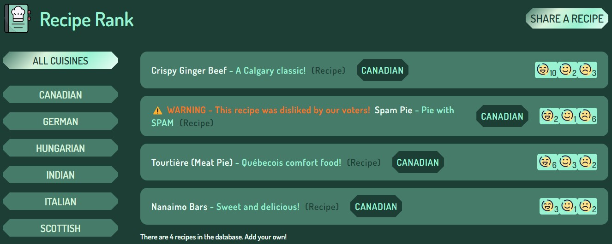

# Recipe Rank

A recipe sharing site that allows visitors to vote on the links submitted.

## Live Demo

A demo can be viewed [here](https://recipe-rank.netlify.app/)

**NOTE:** Anonymous users cannot submit new recipe links, but can still vote on existing ones.

## Preview

## Built With

- [React.js](https://https://react.dev/)
- [Supabase](https://https://supabase.io/)
- [Netlify](https://https://www.netlify.com/)

## Installation

To get a local copy up and running, follow the steps below:
- Install NPM

`npm install npm@latest -g`

- Install NPM packages

`npm install`

- Run on local development server

`npm run start`

- Deploy production build

`npm run build`

By default, the build folder will be placed in the root. Deploy the build folder to your preferred platform.

## Acknowledgements

- Site logo, favicon, and smiley emoji by [Icons8](https://icons8.com/)
